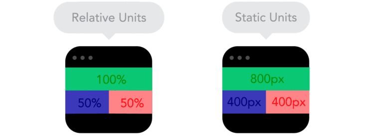
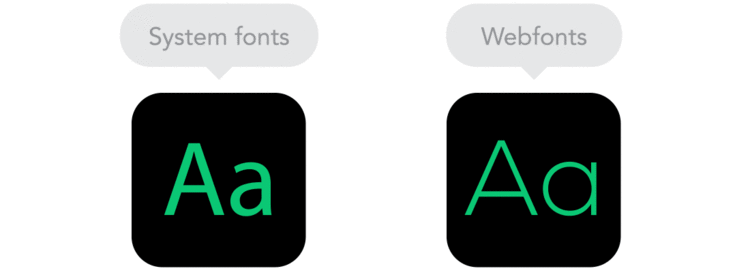

# Week 2

# Objectives

1. [Resources](#resources)
- [NPM](#npm)
- [SCSS](#scss)
- [Building our own CSS framework](#building-our-own-css-framework)
- [SMACSS](#smacss)
- [A Visual Description of Responsive Design](#a-visual-description-of-responsive-design)
- [SOLID](#solid)
- [JavaScript](#javascript)

---

# Discussion Topics and Homework

### (1.) Monday

**Homework**

1. Do this assignment: [Responsive Timeline](https://github.com/matthiasak/js-assignments/blob/ba308382c346a44a92bccebb790214d0b6dc840f/html-intro-4-timeline/README.md)

### (2.) Tuesday

**Homework**

1. Read http://bonsaiden.github.io/JavaScript-Garden/#types and blog 15 key points or facts
2. Do this assignment: [JS Intro HW - data types, variables, functions, simple math](https://github.com/matthiasak/js-assignments/blob/7710ff376dc0f4bf5c7fa2318317c59b54029f42/js-functions-datatypes-math-1/README.md)

### (2.) Wednesday

**Homework**

1. Do this assignment: [JS functions, loops, structures](https://github.com/matthiasak/js-assignments/blob/b40c26d300174e0d80b835ffc6f9eb591a6732ed/js-functions-practice/README.md)

### (2.) Thursday

**Homework**

- http://www.staticshowdown.com/
- Do this assignment: [ROT13](https://github.com/matthiasak/js-assignments/blob/a9223d3b13b04a1fc942ef9d2f16b65dfa2de64b/rot13/README.md)

---

# Resources

- http://onepagelove.com/
- http://sass-lang.com/guide
- https://www.npmjs.org/
- https://github.com/jonathanpath/SASS-SMACSS
- http://bonsaiden.github.io/JavaScript-Garden/
- http://devdocs.io/
- Mozilla Developer Network: https://developer.mozilla.org/en-US/
- http://blog.keithcirkel.co.uk/how-to-use-npm-as-a-build-tool/
- https://developer.mozilla.org/en-US/docs/Web/Reference/API
- https://developer.mozilla.org/en-US/docs/Web/JavaScript
- https://leanpub.com/understandinges6/read/
- http://blog.andyet.com/2014/08/13/opinionated-rundown-of-js-frameworks
- https://github.com/PROSPricing/js-assessment/tree/master/app
- https://github.com/enaqx/awesome-react
- http://backbonejs.org
- https://github.com/instanceofpro/awesome-backbone
- https://github.com/h5bp/Front-end-Developer-Interview-Questions/blob/master/README.md
- http://youmightnotneedjquery.com/

---

# NPM

"Node Package Manager" is the metadata and tool for storing information about a project, automating some scripts, and recording information such as dependencies and tools that should be installed alongside the codebase.

We will walk through [this package.json file](./extras/package.json) to further discuss.

---

# SCSS

## An Introduction to SCSS (Sassy CSS)

LESS, Sass and Compass compile a language into CSS (which can be read by a browser). These are called CSS Preprocessors. The (arguably) most popular of these preprocessors is SCSS, which is a derivative of the original Sass language, but has taken over the official Sass nomenclature. In otherwords, Sass and SCSS are nearly synonymous now.

## SCSS syntax

- variables

    ```scss
    $font-stack:    Helvetica, sans-serif;
    $primary-color: #333;

    body {
        font: 100% $font-stack;
        color: $primary-color;
    }
    ```

- nesting

    ```scss
    nav {
        ul {
            margin: 0;
            padding: 0;
            list-style: none;
        }

          li { display: inline-block; }

        a {
            display: block;
            padding: 6px 12px;
            text-decoration: none;
        }
    }
    ```

- partials and import

    You can create partial Sass files that contain little snippets of CSS that you can include in other Sass files. This is a great way to modularize your CSS and help keep things easier to maintain. A partial is simply a Sass file named with a leading underscore. You might name it something like `_partial.scss`. The underscore lets Sass know that the file is only a partial file and that it should not be generated into a CSS file. Sass partials are used with the `@import` directive.

    ```scss
    // _reset.scss

    html,
    body,
    ul,
    ol {
        margin: 0;
        padding: 0;
    }
    ```

    ```scss
    /* base.scss */

    @import 'reset';

    body {
        font: 100% Helvetica, sans-serif;
        background-color: #efefef;
    }
    ```

- mixins and extensions

    Mixins exist to avoid repeating a lot of stuff.

    ```scss
    @mixin border-radius($radius) {
      -webkit-border-radius: $radius;
         -moz-border-radius: $radius;
          -ms-border-radius: $radius;
              border-radius: $radius;
    }

    .box { @include border-radius(10px); }
    ```

    Extensions exist to create subclasses of classes, etc.

    ```scss
    .message {
        border: 1px solid #ccc;
        padding: 10px;
        color: #333;
    }

    .success {
        @extend .message;
        border-color: green;
    }

    .error {
        @extend .message;
        border-color: red;
    }

    .warning {
        @extend .message;
        border-color: yellow;
    }
    ```

- operators

    tldr; `+`, `-`, `*`, `/`, `%`

    ```scss
    .container { width: 100%; }

    article[role="main"] {
        float: left;
        width: 600px / 960px * 100%;
    }

    aside[role="complimentary"] {
        float: right;
        width: 300px / 960px * 100%;
    }
    ```

---

# Building our own CSS framework

- Typography
- Icons
- Grid
- mobile-first
- off-screen nav
- modals
- menu-bars
- ...

---

# SMACSS

SMACSS (pronounced “smacks”) is more style guide than rigid framework. There is no library to download or install. SMACSS is a way to examine your design process and is a way to fit those rigid frameworks into a flexible thought process.

### Categorizing

At the very core of SMACSS is categorization. By categorizing CSS rules, we begin to see patterns and can define better practices around each of these patterns.

There are five types of categories:

1. Base
- Layout
- Module
- State
- Theme

Each category has certain guidelines that apply to it. This somewhat succinct separation allows us to ask ourselves questions during the development process. How are we going to code things and why are we going to code them that way?

### Base rules

Base rules are the defaults. They are almost exclusively single element selectors but it could include attribute selectors, pseudo-class selectors, child selectors or sibling selectors. Essentially, a base style says that wherever this element is on the page, it should look like this.

```css
html, body, form { margin: 0; padding: 0; }
input[type=text] { border: 1px solid #999; }
a { color: #039; }
a:hover { color: #03C; }
```

### Layout rules

Layout rules divide the page into sections. Layouts hold one or more modules together.

```css
#header, #article, #footer {
    width: 960px;
    margin: auto;
}

#article {
    border: solid #CCC;
    border-width: 1px 0 0;
}
```

### Modules

Modules are the reusable, modular parts of our design. They are the callouts, the sidebar sections, the product lists and so on.

```css
.module > h2 {
    padding: 5px;
}

.module span {
    padding: 5px;
}
```

### State rules

State rules are ways to describe how our modules or layouts will look when in a particular state. Is it hidden or expanded? Is it active or inactive? They are about describing how a module or layout looks on screens that are smaller or bigger. They are also about describing how a module might look in different views like the home page or the inside page.

There is plenty of similarity between a sub-module style and a state style. They both modify the existing look of an element. However, they differ in two key ways:

1. State styles can apply to layout and/or module styles; and
- State styles indicate a JavaScript dependency.

It is this second point that is the most important distinction. Sub-module styles are applied to an element at render time and then are never changed again. State styles, however, are applied to elements to indicate a change in state while the page is still running on the client machine.

### Theme rules

Finally, Theme rules are similar to state rules in that they describe how modules or layouts might look, but in a particular theme (night mode?).

It is probably self-evident but a theme defines colours and images that give your application or site its look and feel. Separating the theme out into its own set of styles allows for those styles to be easily redefined for alternate themes.

```css
// in module-name.css
.mod {
    border: 1px solid;
}

// in theme.css
.mod {
    border-color: blue;
}
```

### Naming Rules

By separating rules into the five categories, naming convention is beneficial for immediately understanding which category a particular style belongs to and its role within the overall scope of the page. On large projects, it is more likely to have styles broken up across multiple files. In these cases, naming convention also makes it easier to find which file a style belongs to.

I like to use a prefix to differentiate between Layout, State, and Module rules. For Layout, I use `l-` but `layout-` would work just as well. Using prefixes like `grid-` also provide enough clarity to separate layout styles from other styles. For State rules, I like `is-` as in `is-hidden` or `is-collapsed`. This helps describe things in a very readable way.

```css
/* Example Module */
.example { }

/* Callout Module */
.callout { }

/* Callout Module with State */
.callout.is-collapsed { }

/* Form field module */
.field { }

/* Inline layout  */
.l-inline { }
```

### Rules of State Change

> See http://smacss.com/book/state

### Other tidbits

- keep specificity low

    For example, `body.article > #main > #content > #intro > p > b` would have a depth of applicability of 6 generations. If this selector was written as `.article #intro b` then the depth is still the same: 6 generations.

    The problem with such a depth is that it enforces a much greater dependency on a particular HTML structure.

    **Simplification of rules**

    ```css
    .pod {
        border: 1px solid #333;
    }

    .pod > h3 {
        margin-top: 5px;
    }

    .pod > ul {
        margin-bottom: 5px;
    }
    ```

- keep selectors simple

    Selectors can be fast or slow. To understand what makes a page render, we need to cover a few things first:

    - How CSS gets evaluated

        The style of an element is evaluated on element creation. Each node is evaluated and rendered to the viewport as it is received in order down the HTML.

        As the browser loads and renders an element, the browser scans the CSS, evaluating every CSS statement to find which ones match that element.

        For each CSS statement, the browser will read it from right-to-left and see if it matches the DOM element.

        If you have a rule like `body div#content p { color: #003366; }` then for every element — as it gets rendered to the page — it will:

        - first ask if it is a paragraph element.
        - If it is then it will work its way up the DOM and ask if it is a div with an ID of content.
        - If it finds what it is looking for, it will continue its way up the DOM until it reaches the body.

    - Some rules just suck

        Google Pagespeed (http://code.google.com/speed/page-speed/docs/rendering.html#UseEfficientCSSSelectors) recommends against using the following selectors:

        1. Rules with descendant selectors. E.g. `#content h3`
        - Rules with child or adjacent selectors. E.g. `#content > h3`
        - Rules with overly qualified selectors. E.g. `div#content > h3`
        - Rules that apply :hover to non-link elements. E.g. `div#content:hover`

    - Constrain yourself, don’t choke yourself

        I follow three simple guidelines to help limit the number of elements that need to be evaluated:

            1. Use child selectors
            - Avoid tag selectors for common elements
            - Use class names as the right-most selector

---

# A Visual Description of Responsive Design

- responsive vs. adaptive


- relative vs. static



- with/without breakpoints


- flow vs. static


- nested vs. not nested


- fonts



- max width


- desktop first vs. mobile first


- vectors vs images


---

# SOLID


---

# JavaScript

## Types

1. **Primitives** - simple values that can be passed around and referenced directly. They are kind of like cash. If you give someone a $5 bill, they have the money and they can use it immediately.

    - Numbers - `0`, `-1`, `49.123`, `0x000010`, `2e5`
    - Booleans - `true`, `false`
    - Strings -

        ```js
        'Cool';
        "Cool";
        "That was 'cool'";
        "That was \"cool\"";
        "how much wood could a woodchuck chuck if woodchuck could chuck wood?";
        ```

- **Objects** - more abstract "things". They are like checks. They're too complex to be passed around or referenced directly, you have to know how to use them to actually get the value out of them.

    - Literals

        ```js
        {
            name: "Matt",
            height: "6'2\"",
            Name: "Instructor"  //<-- case sensitive property names
        }
        ```
    - Arrays

        ```js
        var names = ["Matt", "Mark", "Mike", "Mitch", "Moe"];
        ```
    - Functions

        ```js
        function sum(a, b){
            return a+b;
        }
        ```
    - there will be many more...

## Variables

```js
    var x = 5;
```

Variables are like labeled boxes, where the box `x` has the number `5` inside it.

Variables can be named almost anything with alphanumeric characters (numbers, lower and uppercase letters), underscores, and dollar signs ($). The only condition is that the name cannot start with a number.

Variable names are case sensitive.

The convention, but not rule, is to capitalize each word after the first:

```js
    var someCoolVariable;
```

**Declare multiple variables:**

```js
var age, favoriteColor, name;
```

**Declare and assign multiple:**

```js
var age = 37,
    favoriteColor = "green",
    name = "Jake";
```

The following are all reserved words, meaning you cannot create a variable with any of these names:

`arguments`, `break`, `case`, `catch`, `class`, `const`, `continue`, `debugger`, `default`, `delete`, `do`, `else`, `enum`, `export`, `extends`, `false`, `finally`, `for`, `function`, `if`, `implements`, `import`, `in`, `instanceof`, `interface`, `let`, `new`, `null`, `package`, `private`, `protected`, `public`, `return`, `static`, `super`, `switch`, `this`, `throw`, `true`, `try`, `typeof`, `var`, `void`, `while`

> Kevin Henney points out that the “labeled boxes” analogy also works nicely for introducing “arrays (a row or column of boxes) and objects (a group of boxes).” Ikai Lan likes how “box size is a good analogy for type discussions later on.”
>
> https://twitter.com/KevlinHenney/status/372598874462253056
> https://twitter.com/ikai/status/372656503947149312

## Code Comments

In JavaScript, there are two types of comments (a.k.a. ways to put a note in the code)

```js
    // single line comment

    /*
        and a multi-line
        comment
        .
     */
```

## Operators

- assignment operator: `=`
- mathematical operators: `+`, `-`, `*`, `/`, `++`, `--`, `%`
- compound operators: `+=`, `-=`, `*=`, `/=`
- conditional operators: `!`, `==`, `===`, `!=`, `!==`, `>`, `>=`, `<`, `<=`
- binary combinators: `&&`, `||`
- grouping operators: `( ... )` e.g. `(5+9)*3`
- function operators: `()` e.g. `sum(5, 10)`
- string operator: `+`

For more, see https://developer.mozilla.org/en-US/docs/Web/JavaScript/Guide/Expressions_and_Operators

## Accessors

In JavaScript, we can access properties of an object with `.`:

```js
var instructor = {
    name: "Matt",
    height: "6'2\"",
    laptop: {
        type: "MacBook Air"
    }
};

instructor.name; //<-- "Matt"
instructor.laptop.type; //<-- "MacBook Air"
```

## Statements

Statements can consist of a combination of accessors and operators:

```js
instructor.name + " owns a " + 2013 + instructor.laptop.type; //<-- "Matt owns a 2013 MacBook Air"
```

Like a sentence, a statement is one coherent "thought" or instruction.
- It should appear on its own line.
- It should end with a semicolon (a semicolon means "this instruction is over, move to the next one.")

## Assignments

Assignments have a new or existing variable, an assignment operator `=`, and then a statement.

```js
var x = (2 + 45) + "a"; //<-- x is "47a"
x += (45 + 2); //<-- x is "47a47"
```

## Functions

Functions are the reusable, composable building-blocks of JavaScript. Functions are declared and used, sometimes in the same statement, sometimes in a seperate statement:

```
function sum(a, b){
    return a+b;
}
sum(1, 2); //<-- 3

// or


// the following is an anonymous function because it has no name
// when invoking anonymous functions this way, it is called an IIFE
// (Immeidately Invoked Function Expression)

(function (a, b){ 
    return a+b;
})
(1, 2); //<-- 3


```

`return` is a statement inside functions that "unboxes" a value where the function was invoked:

```
var a = sum(1,2) + 4;
// becomes
//  a = 3 + 4
// then
//  a = 7
a; //<-- 7
```

## Strict Mode

ECMAScript 5 has a strict mode that results in cleaner JavaScript, with fewer unsafe features, more warnings, and more logical behavior. The normal (nonstrict) mode is sometimes called "sloppy mode."

You can switch on strict mode by writing it inside functions like this:

```js
function foo() {
    'use strict';
    // ...
}
```

I am going to recommend that you `use strict` mode (see what I did there? :thumbsup:) for the code you write.

## Using JavaScript In Your Websites

### In `<head>`

```html
<head>
  <title>Cool</title>
  <script type="text/javascript">
    var cool = true;
  </script>
</head>
```

### External file (preferred)

At the end of the body:

```html
<body>
  <h1>Hay</h1>
  <script type="text/javascript" src="main.js"></script>
</body>
```

## Accessors (`.` vs `[]`)

```js
sum += person.finishingTime1;
sum += person["finishingTime1"];
sum += person["finishingTime"+1];
```

## Conditional statements and blocks

- `if`

    ```js
    if(){
        ...
    }
    ```

- `if`/`else`

    ```js
    if(){

    } else {

    }
    ```

- `if`/`else if`/`else`

    ```js
    if(){

    } else if(){

    } else if(){

    } else {

    }
    ```

- `switch`

    ```js
    var answer = "A";

    switch (answer.toLowerCase()) {
        case "A":
            console.log("Correct");
            break;
        default:
            console.log("Incorrect");
            break;
    }
    ```

- `ternary`

    ```js
    var result = true ? "yey for red" : "it's actually salmon"; //<-- "yey for red"
    ```

- `short-circuited statement`

    ```js
    var isMyShirtRed = false;
    var result = (!isMyShirtRed && "it's actually salmon") || "yey for red";
    ```

## Loops

- `for`

    ```js
    for(declare vars; conditional; modifier){
        .. do shit X amount of times
    }
    ```

- `for-in`

    ```js
    "use strict";

    var matt = {
        finishingTime1: 240, //in minutes
        finishingTime2: 210.4,
        finishingTime3: 235.1,
        finishingTime4: 208.9,
        finishingTime5: 197.5,
        unqualifyingFinishingTime: 250.5,
        unqualifyingFinishingTime2: 350.5
    };

    var getAverageTime = function(person) {
        "use strict";
        var sum = 0;
        for(var index in person){
            sum += person[index];
        }
        return sum / Object.keys(person).length;
    }

    console.log(getAverageTime(matt));
    ```

- `while`

    ```js
    var matt = {
        finishingTime1: 240, //in minutes
        finishingTime2: 210.4,
        finishingTime3: 235.1,
        finishingTime4: 208.9,
        finishingTime5: 197.5,
    };

    var getAverageTime = function(person) {
        "use strict";

        var sum = 0,
            i = 1,
            length = Object.keys(person).length;

        while(i <= length){
            sum += person["finishingTime"+i];
            i++;
        }

        return sum / length;
    }

    console.log(getAverageTime(matt));
    ```

- `do`/`while`

    ```js
    var matt = {
        finishingTime1: 240, //in minutes
        finishingTime2: 210.4,
        finishingTime3: 235.1,
        finishingTime4: 208.9,
        finishingTime5: 197.5,
    };

    var getAverageTime = function(person) {
        "use strict";

        var sum = 0,
            i = 1,
            length = Object.keys(person).length;

        do {
            sum += person["finishingTime"+i];
            i++;
        } while(i <= length)

        return sum / length;
    }

    console.log(getAverageTime(matt));
    ```

## Arrays

- creating arrays

    ```js
    var names = ['matt', 'mark', 'mike'];

    // or

    var names = new Array(3);
    name[0] = 'matt';
    name[1] = 'mark';
    name[2] = 'mike';
    ```

- array methods and properties

    - `length`
    - `indexOf` / `lastIndexOf`
    - `push` / `pop`
    - `unshift` / `shift`
    - `join`
    - `forEach`
    - `sort`
    - `reverse`
    - `slice`
    - `filter`
    - `map`
    - `reduce`
    - `concat`

    ```js
    var fruits = [{
        name: "apple",
        color: "red"
    }, {
        name: "strawberry",
        color: "red"
    }, {
        name: "tomato",
        color: "red"
    }, {
        name: "grape",
        color: "red"
    }]

    fruits = fruits.filter(function(fruit){
        return fruit.color === "red";
    }).map(function(fruit){
        return fruit.name;
    })

    console.log(fruits.join(", "));
    ```

## Date()

```js
var x = new Date(),
    y = new Date(1421298156652),
    z = new Date("Wed Jan 14 2015");
    // new Date(year, month[, day[, hour[, minute[, second[, millisecond]]]]]);
```

> See more http://devdocs.io/javascript-date/

## String methods

```js
"a".anchor("test")
"a".bold()
"hello there!".link("test"); //<-- "<a href="test">hello there!</a>"


"    Hi! I'm a string. ".trim(); //<-- "Hi! I'm a string."

"hello".charAt(0); //<-- "h"
"hello"[0]; //<-- "h"

"a".charCodeAt(0); //<-- 97
"b".charCodeAt(0); //<-- 98
"Z".charCodeAt(0); //<-- 90

"Z" < "a"; //<-- true (because "Z"'s charcode is less than "a"' charcode)

String.fromCharCode(97); //<-- "a"

"howdy".indexOf("o"); //<-- 1
"howdy".indexOf("ow"); //<-- 1
"howdy".indexOf("nope"); //<-- -1

"hello there!".length; //<-- 12

"howdy".replace("owd", "ey bab"); //<-- "hey baby"

"hi mi fli whi GI Ri Shi".replace(/i/, "a"); //<-- "ha mi fli whi GI Ri Shi"
"hi mi fli whi GI Ri Shi".replace(/i/ig, "a"); //<-- "ha ma fla wha Ga Ra Sha"
"hi mi fli whi GI Ri Shi".replace(/hi/ig, "a"); //<-- "a mi fli wa GI Ri Sa"

"a-b-c".split(""); //<-- ["a", "-", "b", "-", "c"]
"a-b-c".split("-"); //<-- ["a", "b", "c"]

"hello there!".substr(0, 5); //<-- "hello"
"hello there!".substr(1, 5); //<-- "ello "
"hello there!".substr(2, 5); //<-- "llo t"
"hello there!".substr(3, 5); //<-- "lo th"
"hello there!".substr(4, 5); //<-- "o the"
"hello there!".substr(5, 5); //<-- " ther"
"hello there!".substr(6, 5); //<-- "there"

"i'M AlL FuNKy LoOkINg".toLowerCase(); //<-- "i'm all funky looking"
"i'M AlL FuNKy LoOkINg".toUpperCase(); //<-- "I'M ALL FUNKY LOOKING"
```

## Regular Expressions (or RegEx for short)

In JS, there is a `RegExp` Object. RegEx is used to test for patterns in strings (i.e. the `type="email"` and `pattern="[a-zA-Z]+"` attributes on an HTML element uses RegEx to **test for matches**).

We will use RegEx most often through two primary approaches:

1. We know a string `x`, and would like to test for any occurrences of a RegExp `y`,
- or we know a RegExp `y` and would like to find the matches (if any) from a string `x`

**Example 1**

- The dot (.) matches any character. If you want to match the dot as a character, escape it like this: \.
- A question mark (?) means that the preceding character is optional. If you want to match an actual question mark, escape it: "\?"
- The star (*) matches 0 or more characters
- The plus (+) matches 1 or more characters
- The parens () group states together
- The square brackets [] define a character-group
- The ^ at the front of a character-group [] means "not"
- The "/g" at the end of the RegEx object means "global", so `.match()` returns an array of matches instead of just one
- The "\d" means "decimal", and "\D" means "not a decimal"
- {x} for an exact number of repetitions, {x,y} for varying number of repetitions (where x and y are numbers)
- Also, there is the special "\b" pattern which matches the boundaries at the ends of words (not a real symbol).

```javascript
var text = 'The eyes of Texas are upon you.';

// Will match both "elit" and "elat". The dot can match any character.
var regex = /./g;
console.log( text.match(regex) );

// Will match both "est" and "lest". The question mark makes "l" optional.
var regex2 = /l?est/g;
console.log( text.match(regex2) );

// Match only "cat" and "can", but not "car".
var text = 'cat car can';
console.log( text.match(/ca[tn]/g) );

// Match everything BUT cat and can (notice the ^ symbol)
console.log( text.match(/ca[^tn]/g) );

// Here is another example, which matches only the number
text = 'I would like 8 cups of coffee, please.';
console.log('How many cups: ' + text.match( /[0-9]/g ));

// A better, shorter way to write it, using the \d character class
console.log('How many cups: ' + text.match( /\d/g ));

// Matching everything BUT the number (will return an array of chars)
console.log( text.match(/\D/g) );

//////////--------------

text = 'Hello people of 1974. I come from the future. In 2015 we have laser guns, hover boards and live on the moon!';

// Find the years. \d+ will match one or more chars
var yearRegex = /\d+/g;
console.log('Years: ', text.match( yearRegex ) );

// Find all sentences. Our sentences begin with a capital letter and end in either a dot or an exclamation mark.
// The question mark makes the regex non-greedy. Try removing it.
var sentenceRegex = /[A-Z].+?(\.|!)/g;
console.log('Sentences: ', text.match(sentenceRegex) );

// Find all words that begin with h. We want to match both lower and upper case, so we include the i modifier.
// Notice the \b for word boundary. Try removing it.
var hWords = /\bh\w+/ig;
console.log('H Words: ', text.match(hWords) );


// Find all words between four and six characters
var findWords = /\b\w{4,6}\b/g;
console.log( 'Words between 4 and 6 chars: ', text.match(findWords) );


// Find words longer than 5 chars
console.log( 'Words 5 chars or longer: ', text.match(/\b\w{5,}\b/g) );


// Find words exactly 6 chars long
console.log( 'Words exactly 6 chars long: ', text.match(/\b\w{6}\b/g) );
```

**Example 2**

RegEx keeps track of the groups () it has matched, and automatically numbers them.

```js
// Find the words which consist only of the same letters
var text = 'Abc ddefg, hijk lllll mnopqr ssss. Tuv wxyyy z.';
var sameLetterRegex = /\b(\w)\1*\b/g;
console.log( text.match(sameLetterRegex) );
```

Aside from matching character patterns in strings, we can use RegEx to to substitute text out (think "find and replace" feature of text editors). We can do this with `String.replace()`.

```js
// Let's turn "John Smith" into "Smith, John"
// Each group (\w+) matches a single word. Each group is assigned
// an index, starting from $1
var name = 'John Smith';
var nameRegex = /(\w+) (\w+)/;
console.log( name.replace(nameRegex, '$2, $1') );


// For more advanced manipulations, we need to provide a JS callback.
// For example, lets make the surname uppercase
var upcasename = name.replace(nameRegex, function(string, group1, group2){
    return group2.toUpperCase() + ', ' + group1;
});

console.log( upcasename );
```

## DOM APIs

- `document.querySelector`
- `document.querySelectorAll`
- `document.getElementById`
- `document.getElementByTagName`
- `document.getElementsByClassName`

**what we can edit/read on DOM elements**

- `attributes` on an element `element['attributeName']` (i.e. `element.id`, `element.tagName`, or `element.className`)
- `innerHTML`
- `style`
- and many more...

> See http://devdocs.io/dom/htmlelement for more

## jQuery's AJAX functions

jQuery has some built-in methods of requesting and sending information to and from a server. We covered `$.get()` and `$.getJSON` today. We will get to posting information to a server shortly.

- `$.get(url).then(function(data){...})`

    http://api.jquery.com/jQuery.get/


- `$.getJSON(url).then(function(data){...})`

    http://api.jquery.com/jQuery.getJSON/


- `$.ajax(options).then(function(data){...})`
- `$.post(url).then(function(data){...})`

All of the above methods return a **jQuery Promise** object that has a `then` method. This is how we handle **asynchronous** communications in JavaScript. Promises are used because we don't know when the AJAX request will return (.5s? 1s? 10s? never?).

```js
var githubUsername = "matthiasak";
var url = "https://api.github.com/users/"+githubUsername;
var result = $.get(url);
result.then(function(data){
    // do something with the data retrieved
})
```

## Promises, `$.Deferred`, `$.get/getJSON/ajax/post`

`$.get()` is built on top of a built-in object in JavaScript called `XMLHttpRequest`.

First off, to see how much crazy detail exists for `XMLHttpRequest()`'s, have a look at https://developer.mozilla.org/en-US/docs/Web/API/XMLHttpRequest.

### XMLHttpRequest

Using `XMLHttpRequest` is a bit like this:

```js
var myRequest = new XMLHttpRequest();
myRequest.onload = function(){
    var json = JSON.parse(this.responseText);
    console.log(json);
};
myRequest.open("get", "https://api.github.com/users/matthiasak", true);
myRequest.send();
```

This is actually quite similar to yesterday's `$.getJSON()` example:

```js
$.getJSON("https://api.github.com/users/matthiasak").then(function(data){
    console.log(data);
})
```

### Building our own Promises (but very incomplete)

Both methods still use a `callback` function: `myRequest.onload = ...` and `$.get().then(...)`. This implies some sort of magic that jQuery uses... but really... it isn't magic at all. :-)

Imagine a `Promise` function and prototype:

```js
function Promise(request){}
Promise.prototype.then = function(callback){}
```

Now just assume we can use:

```js
function get(url){
    var myRequest = new XMLHttpRequest();
    var p = new Promise(myRequest);
    myRequest.open("get", url, true);
    myRequest.send();
    return p;
}
````

Then, we can implement the `Promise()` methods:

```js
function Promise(request){
    this.request = request;
}
Promise.prototype.then = function(callback){
    var self = this;
    var feedDataIntoCallback = function(){
        var json = JSON.parse(self.request.responseText);
        callback(json);
    }

    if(this.request.readyState === 4){
        feedDataIntoCallback();
    } else {
        this.request.onload = feedDataIntoCallback;
    }
}
```

Let's string all of that together:

```js
function get(url){
    var myRequest = new XMLHttpRequest();
    var p = new Promise(myRequest);
    myRequest.open("get", url, true);
    myRequest.send();
    return p;
}
function Promise(request){
    this.request = request;
}
Promise.prototype.then = function(callback){
    var self = this;
    var feedDataIntoCallback = function(){
        var json = JSON.parse(self.request.responseText);
        callback(json);
    }

    if(this.request.readyState === 4){
        feedDataIntoCallback();
    } else {
        this.request.onload = feedDataIntoCallback;
    }
}

get("https://api.github.com/users/matthiasak").then(function(data){
    console.log(data);
})
```

Looks a bit more like `$.get()` now!

```js
$.getJSON("https://api.github.com/users/matthiasak").then(function(data){
    console.log(data);
})
```

jQuery provides so much more than `$.get()`. The real power is in the Promises, which are able to not only handle when **one** request finished, but handle **multiple requests in parallel**.

### Handling multiple Promises in parallel

```js
var promise1 = $.get(...);
var promise2 = $.get(...);

$.when(promise1, promise2).then(function(resultsOfPromise1, resultsOfPromise2){
    // ...
})
```

## DOM Events, `addEventListener()`, and `$.on()`

- http://vimeo.com/96425312 ("What is the event loop?")

## Combining DOM APIs, loops, and strings to dynamically change content on a Github page

**Live drawing data pulled from `$.get()` to the DOM**

```js
// ---------------------
// Let's draw some info from our github profiles to the screen
// NOTE: you will need jQuery loaded on the page!
// ---------------------
var githubUsername = "matthiasak";
var url = "https://api.github.com/users/"+githubUsername;
$.get(url).then(function(data){
    drawProfile(data);
})
function drawProfile(data) {
    document.body.innerHTML = [
        '<h1>',
        data.name,
        '</h1>',
        '<h2> blog:',
        data.blog,
        '</h2>'
    ].join('')
}
```

## `setInterval()`, `setTimeout()`

Test the following in Chrome dev tools:

```js
var d = new Date(),
    interval = 3000; //1000ms = 1s

var id = setInterval(function() {
    d.setTime(d.getTime() + interval);
    console.log(d.getHours() + ":" + d.getMinutes() + ":" + d.getSeconds());
}, interval);
```

If you want to make the interval stop executing every 3000ms, run:

```js
clearInterval(id);
```

## Implicit Type coercion

http://bonsaiden.github.io/JavaScript-Garden/#types

- `instanceof` / `typeof`

## Automatic Semicolon Insertion

Read up on this here: http://bonsaiden.github.io/JavaScript-Garden/#core.semicolon

We talked in class about how JavaScript will imply where semicolons should go if you omit them, and where we can omit curly braces (`{}`) with conditional and loop blocks:

```js
// valid one-line loops
for(...) some one line statement;
while(...) some one line statement;

// valid one-line conditionals
if() some one line statement;

// valid for-loop block
for(...){
    some one line statement;
}

// valid if block
if(){
    some one line statement;
}

// valid return statements
return {};
return {}

// not a good return statement

return //<-- ; assumed here, so undefined will be returned, not {a: 0}
    {
        a: 0
    }

// valid function declaration
function(){
    //...
}

// function declaration in an assignment statement, semicolon recommended
var x = function(){};
```

## debugger with Chrome

- `console.log()`
- `console.assert()`
- `console.count()`
- `console.dir()`
- `console.trace()`
- `console.time()`/`console.timeEnd()`
- `performance.now()`
- `console.timeline()`/`console.timelineEnd()`
- `console.profile()`/`console.profileEnd()`
- `inspect(any html element, or function)`
- `console.timeStamp()` - // label the timeline
- `copy()` - copy an object as a string to clipboard

more info: https://developer.chrome.com/devtools/docs/console-api

## errors, try/catch/finally, throw

```
/**
 * EXAMPLE: when asking the user for a number
 */

function askForANumber(){
    var number = prompt("please provide a number");
    try {
        handleResponse(number);
    } catch(e) {
        // :mindblown:
        console.log(e, e.stack);
        askForANumber(); // recursion
    }
}

function handleResponse(number){
    number = parseFloat(number); // handle decimal places too, with parseFloat
    if(typeof number !== "number" || Number.isNaN(number)){ // is it not a number or is it NaN?
        throw new Error("Whatch'you talkin' bout? SAY WAT AGAIN."); // if yes, throw error
    } else {
        alert('You typed in a number: '+number+'!');
    }
}

askForANumber();
```

## `arguments` (variadic behavior)

```js
/**
 * sum functions
 */
function sumOnlyTwoNumbers(a, b){
    "use strict";
    return a + b;
}
function sumForLoop(){
    "use strict";
    var args = Array.prototype.slice.apply(arguments, []),
        sum = 0;
    for(var i = 0; i < args.length; i++){
        sum += args[i];
    }
    return sum;
}
function sumForEach(){
    "use strict";
    var args = Array.prototype.slice.apply(arguments, []),
        sum = 0;
    args.forEach(function(num){ sum += num; });
    return sum;
}
function sumForEachCustom(){
    "use strict";
    "use strict";
    var args = Array.prototype.slice.apply(arguments, []),
        sum = 0;
    forEach(args, function(){ sum += arguments[0]; });
    return sum;
}

/**
 * forEach functions
 */
function forEach(array, callback){
    "use strict";
    for(var i = 0; i < array.length; i++){
        callback(array[i], i);
    }
}
Array.prototype.forEach = function(callback){
    "use strict";
    for(var i = 0; i < this.length; i++){
        callback(array[i], i);
    }
}
```

## Inheritance / OOP

> http://bonsaiden.github.io/JavaScript-Garden/#object.prototype

```js
    base = new Base();
    Derived.prototype = base; // Must be before new Derived()
    Derived.prototype.constructor = Derived; // Required to make `instanceof` work
```

```js
    function Character(name){
        this.name = name;
    }

    Character.prototype.fight = function(){
        console.log(this.name, this.power);
    }

    function Wizard(name){
        Character.apply(this, arguments);
        this.power = 10;
    }

    Wizard.prototype = new Character();
    Wizard.prototype.constructor = Wizard;
```

## Underscore / lodash

Underscore (http://underscorejs.org/, `bower install underscore`) and lodash (https://lodash.com/, `bower install lodash`) are two sides of the same coin.

People originally used Underscore for two reasons:
- in older browsers, it gave us the ability to use `_.forEach()` even though they don't have ES5 (which provides functions like `Array.prototype.forEach`, etc)
- it also provided a TON of utility functions that today I see as essential to the JavaScript developer's toolbelt

Sometime later, lodash came along and stole the show. Lodash happens to have all the exact same functions AND signatures: (i.e. it also gets stored on a global variable `_` with methods like `_.forEach()`). Lodash simply is faster, which is why I prefer it.

Many of the functions from our previous homework are actually implemented in lodash: https://lodash.com/docs

That means `_.forEach`, `_.filter`, `_.reduce`, `_.map`, `_.where`, `_.reject`, etc are all there. Yey! :yey:

One thing I will focus on today with lodash is new: `_.template`, which can be used to plug data (from AJAX) into HTML and put it on the DOM.

## Making Video Games in JavaScript

Includes topics of:

- `canvas`
- the game loop
- event handling
- and others

Video on "making Space Invaders from scratch": http://vimeo.com/105955605
