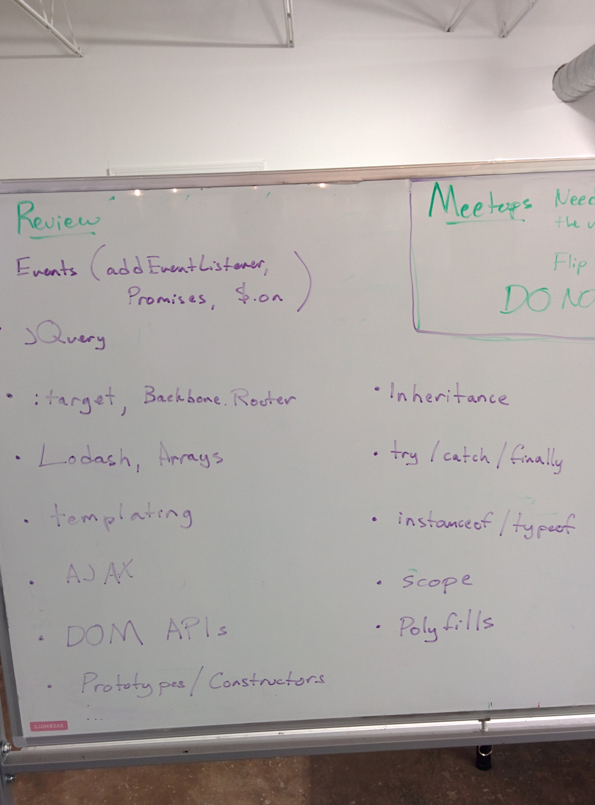
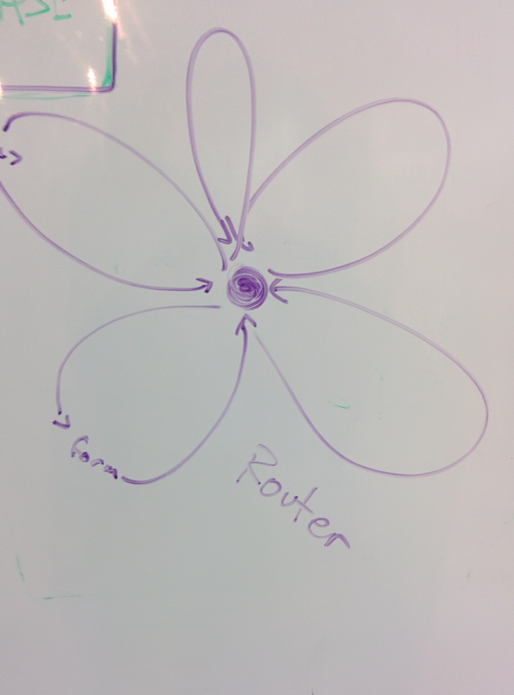
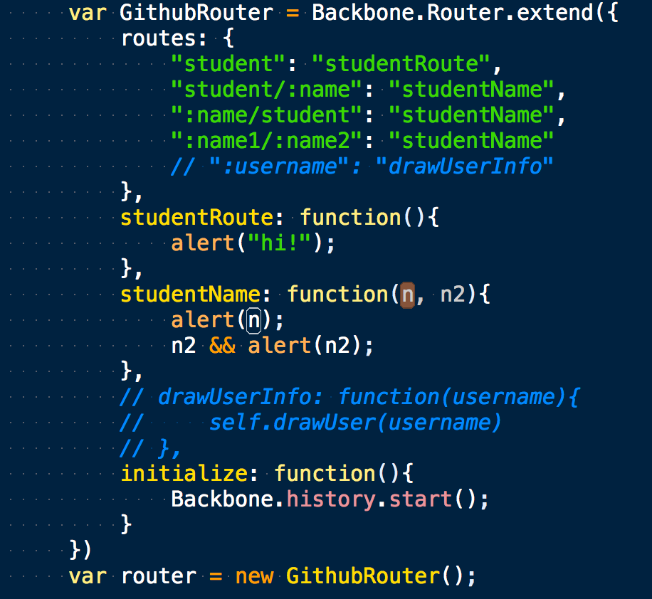
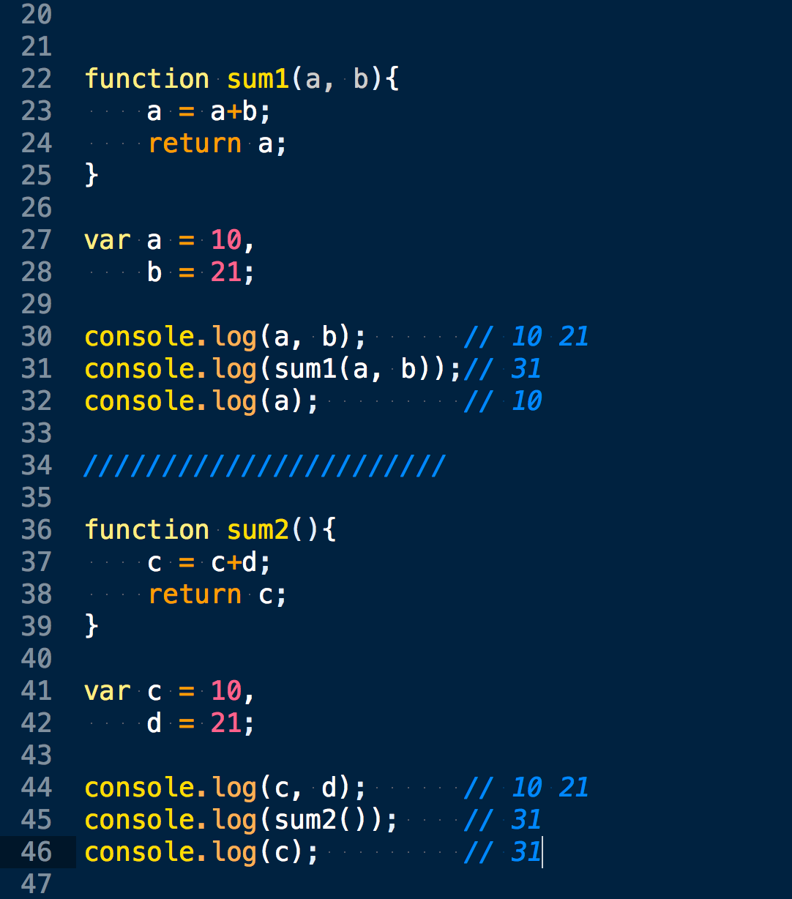
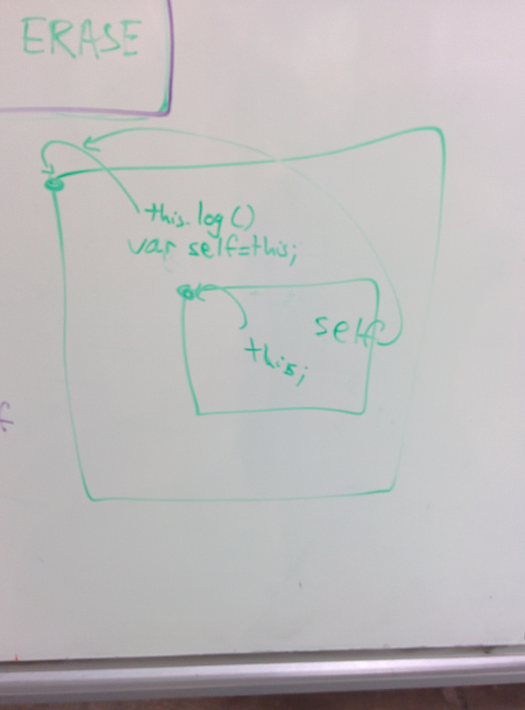
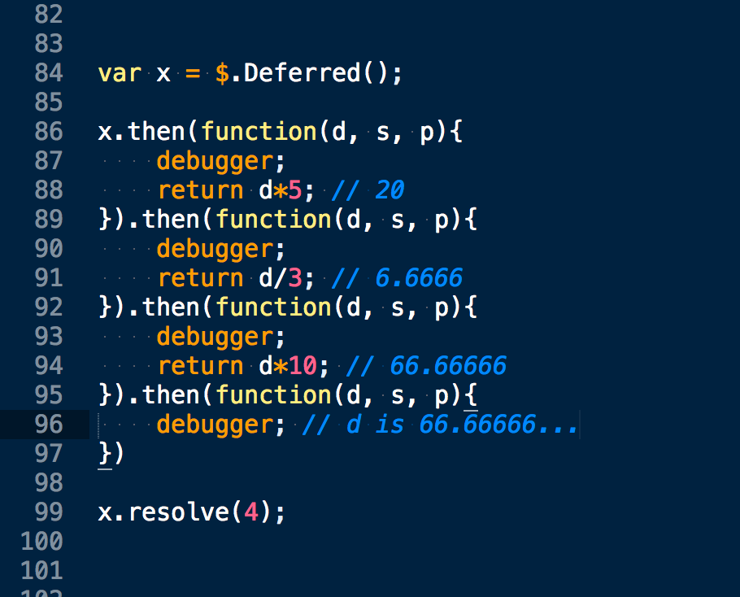

# Week 4

# Objectives

1. DOM Events, `addEventListener()`, and `$.on()`
- Routing
- Polyfills
- Lodash
- Creating our own Promises
- Caching
- Implicit Type coercion
- Error handling 
- Constructors, Prototypes, and Inheritance
- RESTful APIs
- Regular Expressions (or RegEx for short)
- PubSub / Mediator

---

# Discussion Topics and Homework

1. Monday

    - reviewed: http://maprules1000.github.io/TIY-Jan-15-Class-Git-Pages/
    - exercise from today: https://github.com/TIY-Houston-Front-End-Engineering/Routing-1-Vanilla-and-Backbone
    - gh-pages version: http://tiy-houston-front-end-engineering.github.io/Routing-1-Vanilla-and-Backbone/
    - **Homework**

        1. Complete and polish up your homework assignments (as much as you can, check with me if you have questions). You'll receive an email with a Status Report from me by 1pm.
        2. When you finish fixing your work, review: [map and filter](https://github.com/cjros/js-assignments/blob/master/three-part.js)
        3. Finally, create your own repo, and replicate http://maprules1000.github.io/TIY-Jan-15-Class-Git-Pages/ with Routing (Backbone). 

        > Remember that the [exercise from today](https://github.com/TIY-Houston-Front-End-Engineering/Routing-1-Vanilla-and-Backbone) has an example Backbone Router.

- Tuesday

    - reviewed: http://maprules1000.github.io/TIY-Jan-15-Class-Git-Pages/
    - exercise from today: https://github.com/TIY-Houston-Front-End-Engineering/Github-Profile-Browser
    - **Homework**

        1. Create a copy of the exercise today and add the right side to the Github Profile Browser (the "detail" part - which shows a user's repo's)

- Wednesday

    - more review
        - [overview of topics considered/covered (in week 4)](#overview)

- Thursday

    - reviewed Github Profile Browser
        - [Github Repo link](https://github.com/TIY-Houston-Front-End-Engineering/Github-Profile-Browser)
        - [gh-pages link](http://tiy-houston-front-end-engineering.github.io/Github-Profile-Browser/#bmagnantb)
    - **homework** (due Thursday: Feb 5th, 2015)
        - [jQuery Etsy](https://github.com/matthiasak/js-assignments/tree/master/map-filter-sort-jquery-etsy)

---

# Overview



---

# Notes

1. DOM Events, `addEventListener()`, and `$.on()`

    - http://youmightnotneedjquery.com/#on
    - http://vimeo.com/96425312 ("What is the event loop?")
    - http://devdocs.io/dom_events/

2. Routing

    > Check out this StackOverflow link on Hipchat: http://stackoverflow.com/questions/10075507/what-does-javascript-routing-buy-you

    When you go to Gmail and load:
    - The _chats_ tab, the URL changes to `https://mail.google.com/mail/u/0/#chats`.
    - The inbox is `https://mail.google.com/mail/u/0/#inbox`.
    - The spam folder is `https://mail.google.com/mail/u/0/#spam`.

    Whenever you click a link that has a URL like:

    ```html
    <a href="#target"></a>
    ```

    - The browser interprets a tap/click on this link as "scroll the element with the target id into view". 
    - If that target id doesn't exist, the browser will scroll to the top of the screen.
    - The URL will now have `#target` at the end.

    JS has an event for these hash changes:

    ```js
    window.addEventListener('hashchange', callback);

    function callback(event){
        console.log(event); // prints out all the properties of the event; check them out!
        console.log(event.newURL);

        var newID = window.location.target;
        // or
        var newID = event.newURL.substring(event.newURL.indexOf('#'));

        console.log(newID); // #target
    }
    ```

    Sometimes, we need to handle hundreds or thousands of routes like "#views/one", "#views/two", "#views/123123kkbjhb". We can't possibly type out a thousand routes by hand; so instead we can use Backbone.Router to do this for us.

    > Note: There are tons of other routing libraries out there; we don't have to use Backbone.

    Example `Backbone.Router` for the "Github Profile Browser":

    ```js
    // define the Router
    var GithubRouter = Backbone.Router.extend({

        routes: {
            "home": "home",
            "views/:name": "loadView" // views/one, views/two, views/123123kkbjhb
        },

        home: function() {
            var page = document.querySelector(".page");
            page.innerHTML = '';
            alert("home")
        },

        loadView: function(name) {
            var page = document.querySelector(".page");
            $.get("./templates/"+name+".html").then(function(html){
                page.innerHTML = html;;
            })
        },

        initialize: function(){
            Backbone.history.start();
        }

    });

    // initialize an instance of the Router
    var myGHRouter = new GithubRouter();
    ```

    **Visual descriptions/screenshots**

    
    

3. Scope

    **Visual descriptions/screenshots**

    
    
    

4. Polyfills

    Polyfills are JS libraries that let the developer use modern APIs in browsers that don't support them.

    - Finding polyfills is so easy: https://github.com/Modernizr/Modernizr/wiki/HTML5-Cross-Browser-Polyfills
    - Finding if your browser supports something is so easy: http://caniuse.com/

5. Lodash

    https://lodash.com/docs#template

6. Creating our own Promises

    ```js
    var x = $.Deferred();

    console.log(new Date()); // Jan 27 2015 7:00

    setTimeout(function(){
        
        x.resolve({
            a: 1,
            b: 2,
            c: 3,
            time: new Date()
        });

    }, 5000)

    x.then(function(data){
        data.time; // Jan 27 2015 7:05
    })
    ```

    **Visual descriptions/screenshots**

    
    
    

7. Caching

    > Caching is a term used in networking and computing when a a result can be stored and reused.

    Well, we can cache data requested with `$.get()`:

    ```js
    EtsyClient.prototype.loadTemplate = function(name){
        if(!this.templates){
            this.templates = {};
        }

        var self = this;

        if(this.templates[name]){
            var promise = $.Deferred();
            promise.resolve(this.templates[name]);
            return promise;
        } else {
            return $.get('./templates/'+name+'.html').then(function(data){
                self.templates[name] = data; // <-- cache it for any subsequent requests to this template
                return data;
            });
        }
    }
    ```

    Using `EtsyClient.prototype.loadTemplate()` in this fashion will make a brand new request the first time, and then send back a cached result every call thereafter.

    **Visual descriptions/screenshots**

    

8. Implicit Type coercion

    http://bonsaiden.github.io/JavaScript-Garden/#types

    - `instanceof` / `typeof`
    - How does this tie-in to prototypes?

9. Error handling 

    > ...is important for robust code.

    <!-- errors, try/catch/finally, throw -->

    ```
    console.log( undefined() ); // ERROR: undefined is not a function

    var x = undefined;
    console.log( x() ); // ERROR: undefined is not a function

    // code doesn't break here
    try {
        x();
    } catch(e) {
        console.log(e.message); // ERROR: undefined is not a function
    }

    // code doesn't break here
    try {
        x();
    } catch(e) {
        console.log(e.message); // ERROR: undefined is not a function
    } finally {
        // do something that should always 
        // be run after x(), even if there 
        // was an error
    }
    ```

10. Constructors, Prototypes, and Inheritance

    > http://bonsaiden.github.io/JavaScript-Garden/#object.prototype

    General approach:

    ```js
        base = new Base();
        Derived.prototype = base; // Must be before new Derived()
        Derived.prototype.constructor = Derived; // Required to make `instanceof` work
    ```

    Example:

    ```js
        function Character(name){
            this.name = name;
        }

        Character.prototype.fight = function(){
            console.log(this.name, this.power);
        }

        function Wizard(name){
            Character.apply(this, arguments);
            this.power = 10;
        }

        Wizard.prototype = new Character();
        Wizard.prototype.constructor = Wizard;
    ```

11. RESTful APIs

    ** A database is, in simplest terms, spreadsheet. **

    It has columns (a property name) and rows (the records).

    For the Github API, there are various **resources**: `users`, `repos`, `teams`, `notifications`, `feeds`, `emojis`, and so forth. These are spreadsheet **tables**.

    A resource, like a `person`, is identifiable by a unique attribute such as an `id` or `username`.

    When we interact with databases through a RESTful API, we are given a couple options to interact with resources:

    1. `GET` the information record of a particular resource
    2. `GET` a collection of records for a group of resources
    3. `POST` a new JSON object to the server to create a new record of a resource (i.e. a new `person`)
    4. `PUT` an updated version of a record on the server, such as update a `person`'s name
    5. `DELETE` a record from a resource collection (such as remove a `person` from the database)

    These actions (`GET`, `PUT`, `POST`, `DELETE`) are called HTTP verbs, and are accompanied by equivalent jQuery methods `$.get()`, `$.post()`, and `$.ajax()`.

    Simply put, RESTful API's exist because it means there is a standardized way for front-end and back-end (browser and server-side code) to talk to each other.

    **JSONP**

    Compare these two URLs and what they return (open them in your browser):

    1. https://openapi.etsy.com/v2/listings/183182778?api_key=aavnvygu0h5r52qes74x9zvo
    2. https://openapi.etsy.com/v2/listings/183182778.js?api_key=aavnvygu0h5r52qes74x9zvo&callback=test

    The first one just returns JSON data, the second one returns a js file with a function `test` being called with a large JS object as the argument.

    To use JSONP, we need to change the URL to include two things:

    1. The URL should point to a '.js' file
    2. The URL passed in to `$.get()` should have `&callback=?` at the end.

    **Example:**

    ```js
    var api_key = "aavnvygu0h5r52qes74x9zvo";

    var etsy_url = [
        "https://openapi.etsy.com/",
        "v2/",
        "listings/",
        "active.js", // <--- added '.js' to the end here, because Etsy provides JSONP this way
        "?",
        "api_key=",
        api_key,
        "&callback=?" // <--- told jQuery to handle the request as JSONP
    ].join('');

    $.getJSON(etsy_url).then(function(data){
        console.log(data);
    });
    ```

    **Etsy's REST API and how to use it:**

    1. Create an app with Etsy here: https://www.etsy.com/developers/documentation/getting_started/register. This will give you an API key to use. Some services use API keys to provide authorization and to rate-limit people who make too many requests (i.e. spam thousands of requests per second).
    2. Get your API key from here: https://www.etsy.com/developers/your-apps
    3. API's are released with documentation (how to GET/PUT/POST/DELETE them). One resource on Etsy is called a `listing`, and we can learn how to `GET listings` from https://www.etsy.com/developers/documentation/reference/listing
    4. Test the REST API resources with your own API key:
        - get all active listings: https://openapi.etsy.com/v2/listings/active?api_key=aavnvygu0h5r52qes74x9zvo
        - look at an individual product on the API: https://openapi.etsy.com/v2/listings/114711047?api_key=aavnvygu0h5r52qes74x9zvo
        - that product has a `user_id` that we can use to find the user's details on the Etsy API: https://openapi.etsy.com/v2/users/19181170?api_key=aavnvygu0h5r52qes74x9zvo
    5. Write some code
        ```js
        var api_key = "aavnvygu0h5r52qes74x9zvo";

        var etsy_url = [
            "https://openapi.etsy.com/",
            "v2/",
            "listings/",
            "active.js",
            "?",
            "api_key=",
            api_key,
            "&callback=?"
        ].join();

        $.getJSON(etsy_url).then(function(data){
            console.log(data);
        });
        ```

12. Regular Expressions (or RegEx for short)

    In JS, there is a `RegExp` Object. RegEx is used to test for patterns in strings (i.e. the `type="email"` and `pattern="[a-zA-Z]+"` attributes on an HTML element uses RegEx to **test for matches**).

    We will use RegEx most often through two primary approaches:

    1. We know a string `x`, and would like to test for any occurrences of a RegExp `y`,
    - or we know a RegExp `y` and would like to find the matches (if any) from a string `x`

    **Example 1**

    - The dot (.) matches any character. If you want to match the dot as a character, escape it like this: \.
    - A question mark (?) means that the preceding character is optional. If you want to match an actual question mark, escape it: "\?"
    - The star (*) matches 0 or more characters
    - The plus (+) matches 1 or more characters
    - The parens () group states together
    - The square brackets [] define a character-group
    - The ^ at the front of a character-group [] means "not"
    - The "/g" at the end of the RegEx object means "global", so `.match()` returns an array of matches instead of just one
    - The "\d" means "decimal", and "\D" means "not a decimal"
    - {x} for an exact number of repetitions, {x,y} for varying number of repetitions (where x and y are numbers)
    - Also, there is the special "\b" pattern which matches the boundaries at the ends of words (not a real symbol).

    ```javascript
    var text = 'The eyes of Texas are upon you.';

    // Will match both "elit" and "elat". The dot can match any character.
    var regex = /./g;
    console.log( text.match(regex) );

    // Will match both "est" and "lest". The question mark makes "l" optional.
    var regex2 = /l?est/g;
    console.log( text.match(regex2) );

    // Match only "cat" and "can", but not "car".
    var text = 'cat car can';
    console.log( text.match(/ca[tn]/g) );

    // Match everything BUT cat and can (notice the ^ symbol)
    console.log( text.match(/ca[^tn]/g) );

    // Here is another example, which matches only the number
    text = 'I would like 8 cups of coffee, please.';
    console.log('How many cups: ' + text.match( /[0-9]/g ));

    // A better, shorter way to write it, using the \d character class
    console.log('How many cups: ' + text.match( /\d/g ));

    // Matching everything BUT the number (will return an array of chars)
    console.log( text.match(/\D/g) );

    //////////--------------

    text = 'Hello people of 1974. I come from the future. In 2015 we have laser guns, hover boards and live on the moon!';

    // Find the years. \d+ will match one or more chars
    var yearRegex = /\d+/g;
    console.log('Years: ', text.match( yearRegex ) );

    // Find all sentences. Our sentences begin with a capital letter and end in either a dot or an exclamation mark.
    // The question mark makes the regex non-greedy. Try removing it.
    var sentenceRegex = /[A-Z].+?(\.|!)/g;
    console.log('Sentences: ', text.match(sentenceRegex) );

    // Find all words that begin with h. We want to match both lower and upper case, so we include the i modifier.
    // Notice the \b for word boundary. Try removing it.
    var hWords = /\bh\w+/ig;
    console.log('H Words: ', text.match(hWords) );


    // Find all words between four and six characters
    var findWords = /\b\w{4,6}\b/g;
    console.log( 'Words between 4 and 6 chars: ', text.match(findWords) );


    // Find words longer than 5 chars
    console.log( 'Words 5 chars or longer: ', text.match(/\b\w{5,}\b/g) );


    // Find words exactly 6 chars long
    console.log( 'Words exactly 6 chars long: ', text.match(/\b\w{6}\b/g) );
    ```

    **Example 2**

    RegEx keeps track of the groups () it has matched, and automatically numbers them.

    ```js
    // Find the words which consist only of the same letters
    var text = 'Abc ddefg, hijk lllll mnopqr ssss. Tuv wxyyy z.';
    var sameLetterRegex = /\b(\w)\1*\b/g;
    console.log( text.match(sameLetterRegex) );
    ```

    Aside from matching character patterns in strings, we can use RegEx to to substitute text out (think "find and replace" feature of text editors). We can do this with `String.replace()`.

    ```js
    // Let's turn "John Smith" into "Smith, John"
    // Each group (\w+) matches a single word. Each group is assigned
    // an index, starting from $1
    var name = 'John Smith';
    var nameRegex = /(\w+) (\w+)/;
    console.log( name.replace(nameRegex, '$2, $1') );


    // For more advanced manipulations, we need to provide a JS callback.
    // For example, lets make the surname uppercase
    var upcasename = name.replace(nameRegex, function(string, group1, group2){
        return group2.toUpperCase() + ', ' + group1;
    });

    console.log( upcasename );
    ```


13. PubSub / Mediator

    ```js
    ;(function($) {

        var mediator = $({});

        $.subscribe = function() {
            mediator.on.apply(mediator, arguments);
        };

        // example
        // 
        // $.subscribe("mattWantsCoffee", callback)
        // 
        // ~~~~> arguments is ["mattWantsCoffee", callback]
        // 
        // BAD:             $.subscribe(arguments)
        // DESIRED EFFECT:  $.subscribe("mattWantsCoffee", callback)
        // TO DO THE ABOVE: mediator.on.apply(mediator, arguments)

        $.unsubscribe = function() {
          mediator.off.apply(mediator, arguments);
        };

        $.publish = function() {
            mediator.trigger.apply(mediator, arguments);
        };

    })($);

    // USAGE:
    // 
    // 1. listen for events in module A

    $.subscribe("IneedCoffeeNAOW", function(event, data){ 
        // do something when event occurs
        console.log(data)
    })

    // 2. trigger event in module B

    $.publish("IneedCoffeeNAOW", { hotOrIced: "hot" })
    ```

    More example code:

    ```js
    function A(){
        var self = this;
        $.subscribe("mattWantsCoffee", function(event, data){
            self.hotOrCold = data.hotOrCold;
        })
    }

    function B(){
        var v = (Math.random() > .5) ? "hot" : "cold";
        $.publish("mattWantsCoffee", {hotOrCold: v})
    }

    window.A = A;
    window.B = B;
    ```
